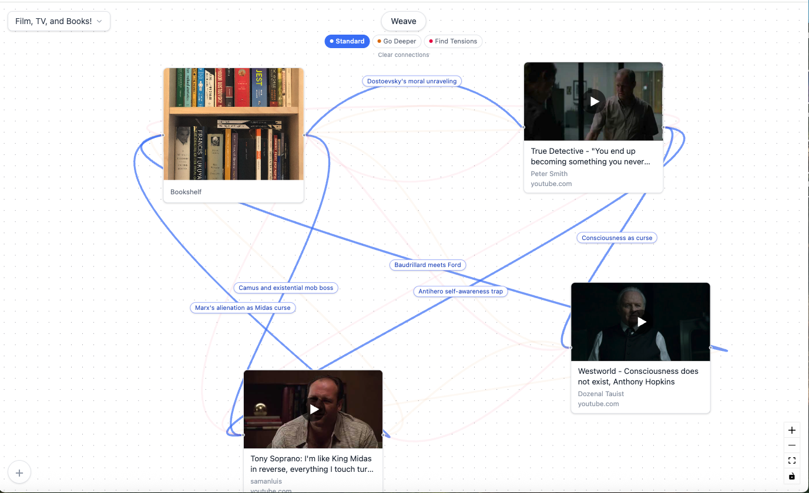
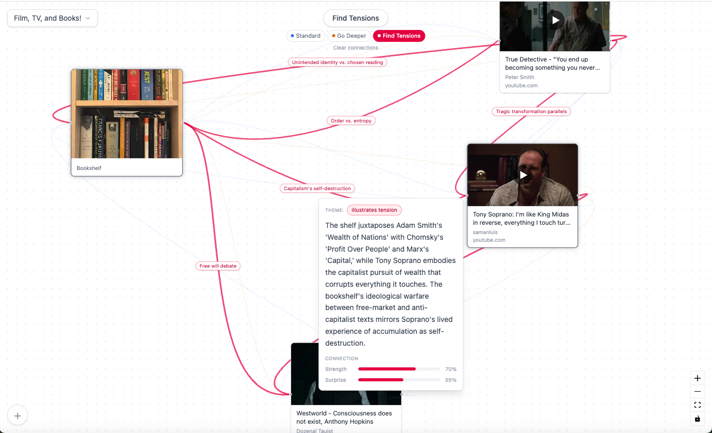
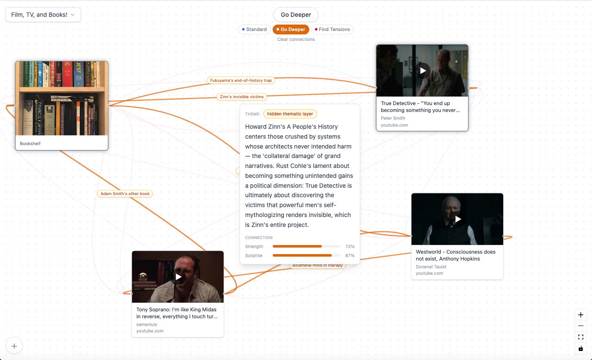

# Weave

Weave is a spatial thinking tool where you drop content onto a canvas — images, text, links, PDFs, tweets, YouTube videos — and let Claude find the connections you can't see on your own.


Hit **Weave**, and Claude analyzes everything on your board using vision and text understanding, then draws a neural graph of relationships between your content. The connections aren't surface-level pattern matching — they're genuine insights that surface non-obvious relationships and help defeat reflexive thinking.



<!--  -->

## How It Works

1. **Add content** to the canvas — drag and drop images or PDFs, paste URLs, or create text cards
2. **Arrange spatially** — move cards around however feels natural
3. **Hit Weave** — Claude analyzes all objects and draws labeled connections between them
4. **Go Deeper** — re-weave with altered prompts to find subtler connections or tensions
5. **Explore** — click any connection label to read Claude's full explanation, see the theme, and review connection strength and surprise scores

## Three Modes of Analysis

- **Standard** (blue) — Initial connections and insights across your content
- **Go Deeper** (amber) — Subtler, less obvious relationships that go beyond first impressions
- **Find Tensions** (rose) — Contradictions, conflicts, and opposing ideas between objects

Each mode adds a new layer of connections. Toggle between layers to focus on one mode at a time — inactive layers fade to 5% opacity so you can still see the network shape without the clutter.



## Content Types

- **Text cards** — Notes, quotes, ideas, anything
- **Images** — Drag and drop from your desktop. Claude sees the actual image content via vision API — it reads book spines, analyzes compositions, interprets visual mood
- **Links** — Paste any URL for an automatic preview card with Open Graph metadata. Rich previews for Twitter/X (full tweet text) and YouTube (thumbnail with play overlay)
- **PDFs** — Drop a PDF to see a first-page thumbnail. Double-click to browse pages with navigation

Double-click images for a full-size lightbox, tweets for an expanded view, or YouTube cards to watch the video inline without leaving the canvas.

## How Claude Thinks

The core of Weave is the system prompt. Rather than forcing connections into predefined categories, Claude generates relationship types organically — producing labels like "theory-to-illustration" or "Dostoevsky's suffering rooms" instead of generic tags like "related" or "thematic." This unconstrained ontology is essential to the tool's anti-reflexivity goal: if we define the categories, we impose our own cognitive framework on the connections.



Each connection includes:
- **Label** — A pithy name for the relationship ("Simulacra made visible")
- **Explanation** — 2-3 sentences of reasoning
- **Theme** — Claude's organic categorization of the relationship type
- **Strength** (0-1) — How strong the connection is, reflected in line thickness
- **Surprise** (0-1) — How non-obvious the insight is. This is Weave's quality metric — high surprise means Claude found something you wouldn't have seen on your own

## Tech Stack

- React + TypeScript (Vite)
- React Flow (canvas interaction)
- Tailwind CSS
- Anthropic Claude API (Opus 4.6 with vision)
- localStorage + IndexedDB (board persistence)

## Setup

```bash
git clone https://github.com/YOUR_USERNAME/Weave.git
cd Weave
npm install
```

Create a `.env` file in the project root:

```
VITE_ANTHROPIC_API_KEY=your-anthropic-api-key-here
```

Start the dev server:

```bash
npm run dev
```

## Board Persistence

Boards auto-save to your browser's local storage. Create multiple boards and switch between them using the dropdown in the top-left corner. Images and PDFs are stored in IndexedDB to handle larger files. Board names are editable — double-click to rename.

## The Philosophy

Most thinking tools help you organize what you already know. Weave helps you see what you don't. By letting Claude analyze diverse content together — a bookshelf photo, a tweet about media ownership, a Westworld soundtrack, a Kafka quote — it surfaces intellectual threads that cross media types and domains. The goal isn't to replace your thinking, but to show you the connections your existing assumptions prevent you from seeing.

The shift from predefined connection categories to organic, unconstrained types was a critical design decision. When Claude invents "theory-to-illustration" as a connection type, it's expressing something more precise than any taxonomy we could predefine. The vocabulary of connections grows with the content.

## Roadmap (V2)

- **Connection consolidation** — One line per node pair with the ability to cycle through multiple connections in the detail popup, reducing visual clutter
- **Additional weave modes** — "Find Metaphors", "Find Genealogies", and custom user-defined analysis prompts
- **Additional content types** — Audio clips, code snippets, handwritten notes via camera
- **Custom system prompts** — Write your own analysis instructions beyond the three presets
- **Export and share** — Save a board as an image or shareable link
- **Full deployment** — Auth, backend, database, and image storage for cross-device access
- **General UI polish** — Continued refinements and visual improvements
